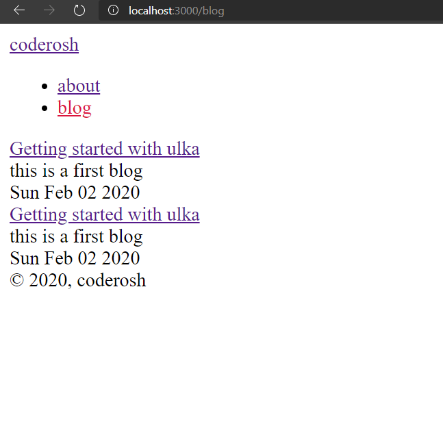

> In this section, we will generate html from markdown files and templates.

## How does this work ?

As a remainder let's look at `contents` key in `ulka-config.js` file.

```js
contents: [
  {
    path: 'contents',
    generatePath: 'blog',
    template: 'blog.ulka',
  },
]
```

You have three keys `path`, `generatePath`, `template`. All three keys are described in [configs](/tutorial/configs) section. But Let's go through them again.

`path` refers to the folder where content is inside the src folder.

`generatePath` is the folder where html files should be generated.

`template` is a file which will be a wrapper around the markdown contents.

<br />

## Creating template file

Let's create a file `blog.ulka` (filename should be same as template key in contents) inside `templates` directory.

And add the following content in that file.

`templates/blog.ulka`

```ulka
<!DOCTYPE html>
<html>
  <head>
    <title>Blog</title>
  </head>
  <body>
    <div class="container">
      <main>
        <nav>
          <div class="title">
            <a href="/">coderosh</a>
          </div>
          <ul id="nav-links">
            <li><a href="/about">about</a></li>
            <li><a href="/blog">blog</a></li>
          </ul>
        </nav>
        <div class="blog-title">Title</div>
        <span class="blog-date">Date</span>
        <div class="blog-body">
          <!-- data from contents goes here -->
        </div>
      </main>
      <footer>&copy; 2020, coderosh</footer>
    </div>
  </body>
</html>
```

We have just added the placeholder contents. We will add real content data soon.

<br />

## Adding contents

After the template is created, let's create two files with name post-1.md and post-2.md inside `contents` folder (this folder's name should be same as `path` key discussed above).

After creating files navigate to `/blog/post-1` or `/blog/post-2` in your browser. In both, you will see the html we have written in `templates/blog.ulka`.

Now, let's write some markdown inside post-1.md and post-2.md

`post-1.md`

```markdown
---
title: 'Getting started with ulka'
description: 'this is a first blog'
date: 2020-02-02
---

# This is a heading 1

> This is a quote

Lorem ipsum dolor sit amet, consectetur adipiscing elit. Suspendisse eros magna.

## This is heading 2
```

`post-2.md`

```markdown
---
title: 'This is a second blog'
description: 'hello from the second blog'
date: 2020-02-04
---

# Thi is the second post
```

You may have noticed there is written something inside those triple-dashed lines. Let's discuss what's all that about.

<br />

## Front matter

That content inside triple-dashed lines is front matter. That syntax you are seeing in between triple-dashed lines is yaml. Yaml frontmatter is processed by ulka and made available into the ulka files. You can use front matter to provide information to template about the markdown content and many more.

<br />

## Using the frontmatter

In `post-1.md` and `post-2.md` we have written frontmatter. That frontmatter has title, description and date. Now let's use that frontmatter in our `blog.ulka` template file.

In `templates/blog.ulka` we have some placeholder values for title and date. Let's replace them.

```html
<div class="blog-title">Title</div>
<span class="blog-date">Date</span>
```

Replace the above code with following.

```ulka
<div class="blog-title">\</div>
<span class="blog-date">\</span>
```

Values is a [global variable](/tutorial/globalvars) available in every `template` file. Ulka parses yaml frontmatter in content to object and adds that frontmatter to values object.

Now if you navigate to the page `/blog/post-1` and `/blog/post-2` you will see the title and date from the front matter.

<br />

## Rendering markdown data

If successively used front matter in our template file. Now we will render the markdown as html inside the template. Behind the scene ulka will render the markdown as html and provide it to template file as `data` variable. Let's use that `data` variable in `templates/blog.ulka`.

In `templates/blog.ulka` we have a comment as a placeholder for contents.

```html
<div class="blog-body">
  <!-- data from contents goes here -->
</div>
```

Let's replace that comment with the data variable.

```ulka
<div class="blog-body">
  \
</div>
```

Now when you visit the navigate to the page `/blog/post-1` and `/blog/post-2` you will see markdown data that is inserted inside the template file `blog.ulka`.

<br />

## Listing all the blogs

We successively created html from markdown and template files. Now let's show lists of all the posts inside `pages/blog.ulka`.

All the files in pages directory have a variable called `contents` which consists info about the created contents. Let's use that variable and show the lists of all the created posts.

Open `pages/blog.ulka`. We have the placeholder for list of blogs in that file.

```ulka
<div id="blogs">
  <!-- list of blog goes here -->
</div>
```

Let's replace the above content with the following.

```ulka
<div id="blogs">
  \
</div>
```

Let's descuss what's happening there. `contents` has a key named `blog` (this is the same name we specified in contents[0].name). `contents.blog` is an array of object with info (values, link or url to the path, file stats etc.) about the contents inside `contents` directory.

All we are doing there is looping through the array and returning some html. Ulka will join the array and return a string.

Now if you navigate to `/blog` you will see the lists of posts we have created. If may want to sort your contents according to created date while displaying the list. For that we can use javascript's `sort` method. But if we sort it directly then it will change the original array `contents.blog` due to which we may receive unexpected output. So prevent that we will `slice` method which will create a new array for us.

```ulka
<div id="blogs">
  \{%
    contents
      .blog
      .slice()
      .sort((a, b) => new Date(b.values.frontMatter.date) - new Date(a.values.frontMatter.date))
      .map(content =>  `
        <div class="blog-item">
          <a href="${content.link}">
            <div class="blog-title">${ content.values.frontMatter.title }</div>
          </a>
          <div class="blog-desc">
            ${ content.values.frontMatter.description }
          </div>
          <div class="blog-date">
            ${ new Date(content.values.frontMatter.date).toDateString() }
          </div>
        </div>
      `)
  %}
</div>
```

Replace the previous logic with this. This will sort the contents according to the date in frontmatter. Now, if you navigate to `/blog` you will see the list of contents sorted according to date.



If you are following from the begining then `contents`, `templates` and `pages` should be pretty clear till now. In next section we will separate repeated ulka code into different files.
